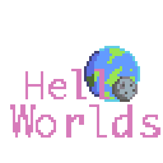

  

# Hello Worlds 👋🌐

Your Virtual Worldbuilding toolkit for the web

> **⚠ Hic Sunt Dracones ⚠**
>
> These tools are (extremely!) work-in-progress; The code base will likely change _daily_, along with the APIs! Be forwarned!
>
> If you're interested in using this library and want to keep up to date, please [follow me on Twitter](https://twitter.com/KennyPirman), and/or click the Watch button for this repository.

## Docs 📄

Visit https://worlds.kenny.wtf

## Packages 🎁

| Name                                          | Description                                                                                                                                                                                                                                        |
| --------------------------------------------- | -------------------------------------------------------------------------------------------------------------------------------------------------------------------------------------------------------------------------------------------------- |
| [@hello-worlds/planets](./packages/planets)   | Tools build large-scale planets, moons, planetoids, ring-worlds (von Braun wheels) and other fantastic environments in [`three.js`](threejs.org/), and help you query against them to create interesting features for your game or web experience. |
| [@hello-worlds/react](./packages/react)       | React.js components to easily integrate `@hello-worlds/planets` and other components into your [`@react-three/fiber`](https://github.com/pmndrs/drei) scene                                                                                        |
| [@hello-worlds/tongues](./packages/tongues)   | Tools to build and operate against [ConLangs](https://en.wikipedia.org/wiki/Constructed_language)                                                                                                                                                  |
| [@hello-worlds/cultures](./packages/cultures) | Tools to generate cultures and societies                                                                                                                                                                                                           |
| [@hello-worlds/core](./packages/core)         | shared utilities                                                                                                                                                                                                                                   |

## Questions? 💬

Find me on [Twitter](https://twitter.com/KennyPirman), streaming on [Twitch](https://www.twitch.tv/kennycreates), or the [Poimandres Discord](https://discord.gg/aAYjm2p7c7)

## Where did you get all this crap from? 🤔

[I copied from these smarter people](./SOURCES.md)
